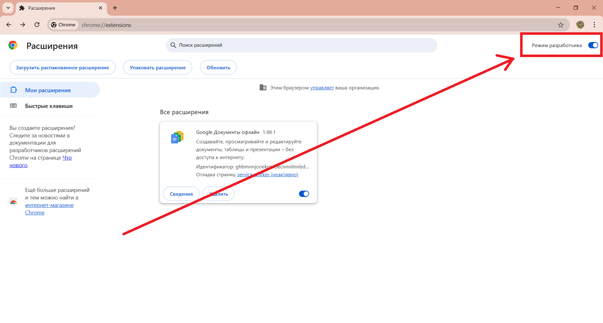
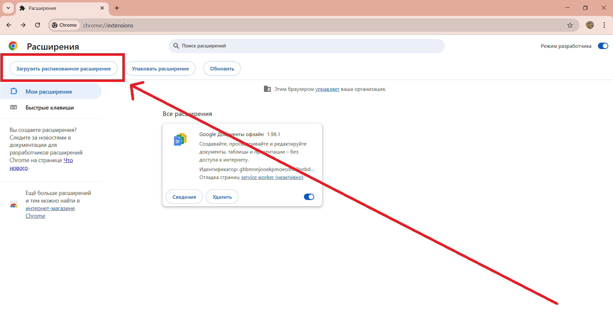
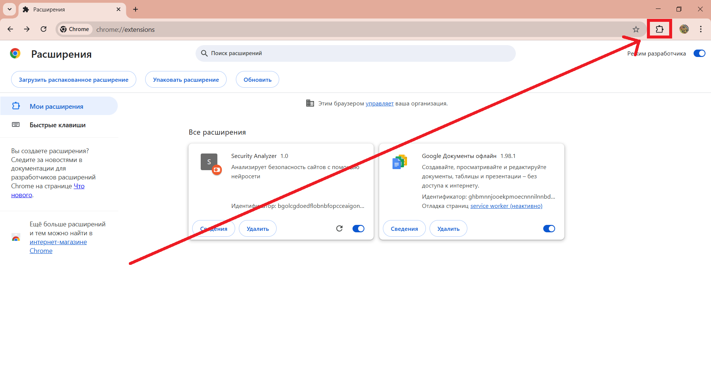

# Расширение браузера Chrome для анализа безопасности сайтов
## Как запустить
1. Склонировать репозиторий
2. В корне склонированного репозитория выполнить ```uvicorn main:app --reload --port 8080```
3. Открыть в браузере Chrome страницу ```chrome://extensions/```
4. Включить в правом верхнем углу режим разработчика

5. Выбрать "Загрузить распакованное расширение"

6. Указать путь до папки extension в склонированном репозитории
7. Нажать на кнопку расширений

8. В списке выбрать Security Analyzer
